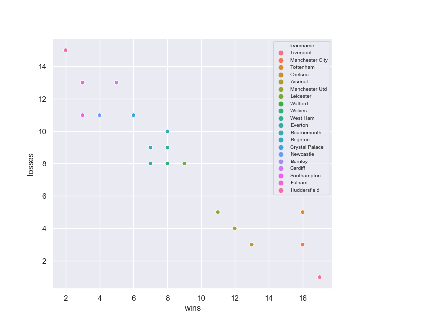

# premierFun

Welcome to Premier Fun, where we will play around with 
Python pandas and seaborn library to create some beautiful 
Data Visualization using the Premier League Data
Due to some legal restrictions, we cannot obtain the actual data for 
the current premier league season's data
We will use the data from past seasons to create the visualization
this will be re usuble as long as the user innputs the data into a json format 

Here is an image of Win-Loss Graph for each teams 

Showing that the strenght of the team goes up as it reaches bottom right corner of the graph
